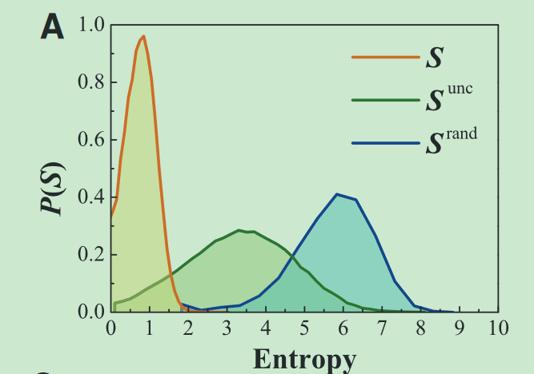
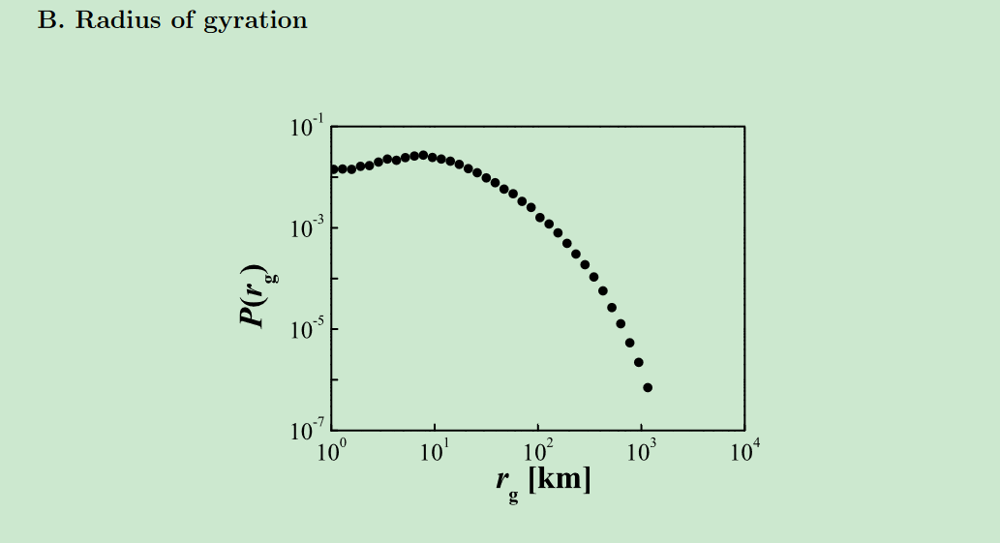
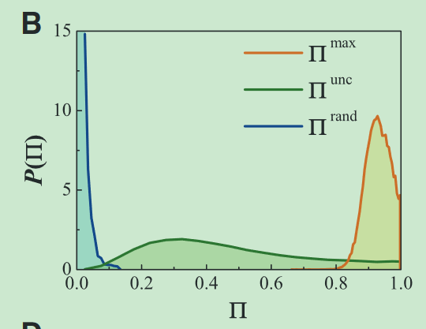
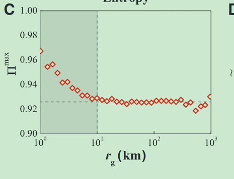
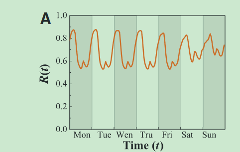
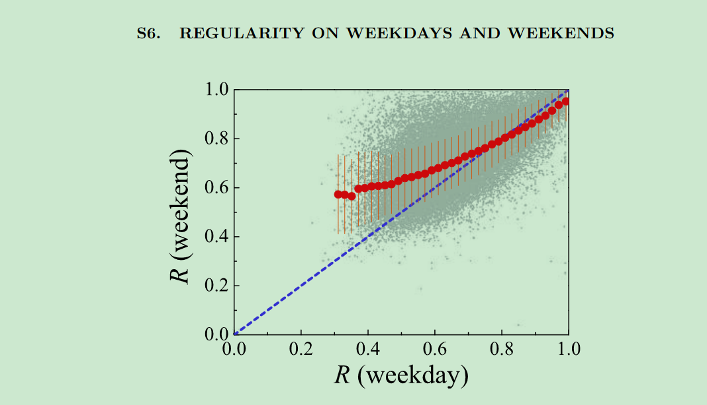

# Limits of Predictability in Human Mobility

> Under construction... 04/22/2024

## Research Problem

To what extent is human mobility predictable?

## Research Method

### Entropy Measurement

1. **Random Entropy**: $ S^{rand}\_{i} = \log_2{N_i}$, where $N_i$ represents the number of distinct locations for a user.
2. **Temporal Unrelated Entropy**: $S^{unc}_{i} = -\sum^{N_i}_{j}{p_i(j) \cdot \log_2{p_i(j)}}$, where $p_i(j)$ represents the probability of visitation at location $j$ by user $i$.
3. **Actual Entropy**: $S_i = -\sum^{Num*{T*i}}*{1}{P_i(T_i) \cdot \log_2{P_i(T_i)}}$, where $T_i$ represents a consecutive temporal location pair in the form of ${X_1, X_2}$ for user $i$, and $P_i$ represents the probability of this pair.

Generally speaking, for each user, $S_i \leq S^{unc}*{i} \leq S^{rand}_{i}$ (larger diversity causes larger entropy).

### Radius of Gyration

Radius of gyration measures the extent of a person's mobility range.

### Π: Measurement of Predictability

> Cannot fully understand the mathematic inference for this index

\( Π \) measures the limits of predictability of a user based on historical information.
\( Π\_{max} \) shows the limit of the predictability of a user.

## Findings

1. Real uncertainty for a typical user's next-step whereabouts is \( 2^{0.8} = 1.74 \).

   

2. The distribution of the **radius of gyration** presents a right-skewed pattern. Based on this pattern, we intuitively assume that **the predictability of individuals should also follow a right-skewed distribution, similar to the radius of gyration** (higher diversity, more difficult to predict).

   

3. The distribution of predictability does not show a right-skewed distribution, indicating that those with higher movement diversity maintain similar predictability as the general public. The distribution mainly focuses around 0.93, which means that for most people, their next-step location predictability is around 93% (all the population shows a similar predictability if we know his historical traj).

   

4. The relationship between individual predictability and their radius of gyration is: predictability decreases with an increase in radius of gyration at first (0-10 km), then becomes independent, and converges to around 0.90+.
   

5. Flow of Probability of finding a person at his most located location at time k is shown in the pics, which is avg. on 0.7.
   

6. Demographics: 1. Gender, 2. Age, 3. Income, 4. Race, 5. Neighborhood, 6. Distance to city. **All are not significant**

7. Weekdays and Weekend: Regularity Insignificant.
   

## Interesting Points

1. Use a comparison to prove that data completeness does not need to be perfect (by measuring the entropy difference for those with perfect data by manually deleting some data).

## Discussion

1. **The predictability of the general public is around 93%.**
2. From the distribution, it's evident that considering locations alone is not effective (both random or with probability). Temporal relationships play a significant role in location prediction tasks. **Temporal effects in location prediction**
3. The hypothesis fails: Individuals with higher radius of gyration do not necessarily have lower predictability. They show a relationship at first but converge with a radius of gyration greater than 10 km. **Higher diversity does not mean lower predictability**
4. Weekends and weekdays show similar regularity, around 0.7. **Holiday effects are not significant.**
5. Demographics do not affect predictability and regularity. **Money or age do not affect regularity and predictability. This is different from my previous stereotype that younger people are more difficult to predict.** Maybe they have higher diversity or distinct locations, but considering their temporal relationships, or most common life, they all show similar patterns.
